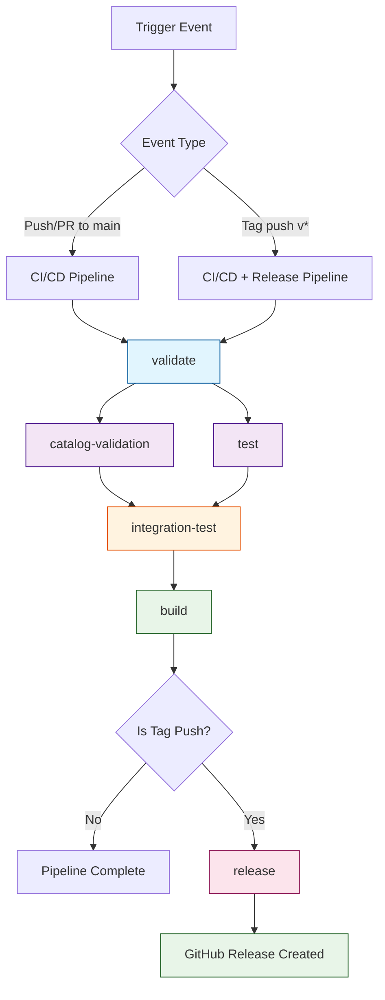

# CI/CD Pipeline Documentation

This document describes the comprehensive CI/CD pipeline for the Traefik CORS Regex Plugin, implemented as a single consolidated GitHub Actions workflow.

## Overview

The CI/CD pipeline is designed to ensure code quality, validate Traefik plugin requirements, run comprehensive tests, and automatically create releases. All functionality is consolidated into a single workflow file (`main.yml`) for better maintainability and clearer dependencies.

## Workflow Triggers

| Trigger | Event | Jobs Executed |
|---------|-------|---------------|
| **Push to main** | Code changes pushed to main branch | All jobs except release |
| **Pull Request** | PR created/updated targeting main | All jobs except release |
| **Tag Push** | Version tag pushed (v*) | All jobs including release |

## Workflow Diagram



## Job Descriptions

### 1. Validate Plugin 🔍
**Purpose**: Basic plugin structure validation
**Dependencies**: None (entry point)
**Duration**: ~30 seconds

**Checks:**
- ✅ `.traefik.yml` manifest file exists
- ✅ `go.mod` file exists  
- ✅ Import paths match between `.traefik.yml` and `go.mod`

### 2. Catalog Validation 📋
**Purpose**: Traefik Plugin Catalog specific requirements
**Dependencies**: `validate`
**Duration**: ~45 seconds

**Checks:**
- ✅ `.traefik.yml` structure validation (all required fields)
- ✅ Plugin instantiation test with testData
- ✅ Dependency verification and cleanliness
- ✅ Go module tidiness

### 3. Unit Tests 🧪
**Purpose**: Code quality and functionality testing
**Dependencies**: `validate`
**Duration**: ~1 minute

**Features:**
- ✅ Full test suite execution with race detection
- ✅ Code coverage reporting
- ✅ Coverage upload to Codecov (non-PR events)
- ✅ Go module caching for faster builds

### 4. Integration Tests 🐳
**Purpose**: End-to-end testing with Docker
**Dependencies**: `test`
**Duration**: ~2-3 minutes

**Features:**
- ✅ Docker-based Traefik integration testing
- ✅ Local mode plugin testing
- ✅ CORS functionality validation
- ✅ Real HTTP request/response testing

### 5. Build Plugin 🔨
**Purpose**: Create production-ready artifacts
**Dependencies**: `test`, `integration-test`, `catalog-validation`
**Duration**: ~30 seconds

**Outputs:**
- ✅ Linux binary (`cors-regex-{version}`)
- ✅ Build artifacts uploaded (GitHub Actions only)
- ✅ Version-tagged binaries

### 6. Release 🚀
**Purpose**: Create GitHub releases (tag pushes only)
**Dependencies**: `build`
**Duration**: ~1 minute

**Features:**
- ✅ Automatic release notes generation
- ✅ Binary artifact attachment
- ✅ Version file inclusion
- ✅ Plugin Catalog readiness verification
- ✅ Installation instructions

## Workflow Details

### File Structure
```
.github/
└── workflows/
    └── main.yml          # Single consolidated workflow
```

### Environment Variables
| Variable | Value | Purpose |
|----------|-------|---------|
| `GO_VERSION` | `1.21` | Go version for all jobs |

### Permissions
| Permission | Level | Usage |
|------------|-------|-------|
| `contents` | `write` | Required for creating releases |

## Local Testing with Act

The pipeline supports local testing using [act](https://github.com/nektos/act):

### Available Commands
```bash
# Setup act test events
make act-setup

# Test CI pipeline (push event)
make act-ci

# Test release pipeline (tag event)  
make act-release

# List available workflows
make act-list
```

### Test Events
- **CI Testing**: Simulates push to main branch
- **Release Testing**: Simulates tag push (v0.1.x)

## Pipeline Flow Examples

### 🔄 Normal Development Flow
```
Developer pushes to main
↓
validate (30s)
↓
catalog-validation + test (parallel, ~1min)
↓
integration-test (~2-3min)
↓
build (30s)
↓
Pipeline Complete ✅
```

### 🏷️ Release Flow
```
Developer creates and pushes tag v0.1.x
↓
validate (30s)
↓
catalog-validation + test (parallel, ~1min)
↓
integration-test (~2-3min)
↓
build (30s)
↓
release (~1min)
↓
GitHub Release Created 🎉
```

## Success Criteria

### For CI (Push/PR)
- ✅ All validation checks pass
- ✅ Unit tests pass with good coverage
- ✅ Integration tests pass
- ✅ Plugin builds successfully

### For Release (Tag Push)
- ✅ All CI criteria met
- ✅ GitHub release created
- ✅ Binary artifacts attached
- ✅ Plugin ready for Traefik Plugin Catalog

## Monitoring and Debugging

### GitHub Actions UI
- Navigate to: `https://github.com/liquidlogiclabs/traefik-plugin-cors-regex/actions`
- View workflow runs, logs, and artifacts
- Monitor job dependencies and timing

### Common Issues and Solutions

| Issue | Cause | Solution |
|-------|-------|----------|
| Validation fails | Missing files or import mismatch | Check `.traefik.yml` and `go.mod` |
| Tests fail | Code issues | Review test output and fix code |
| Integration fails | Docker/Traefik issues | Check Docker logs in workflow |
| Build fails | Go build issues | Verify Go version and dependencies |
| Release fails | Missing permissions | Check `GITHUB_TOKEN` permissions |

### Local Debugging
```bash
# Test specific workflow locally
act push

# Test with specific event
act push -e .github/events/tag-push.json

# Dry run to see what would happen
act push --dry-run

# Verbose output for debugging
act push --verbose
```

## Performance Optimization

### Caching Strategy
- **Go Modules**: Cached using `actions/cache@v4`
- **Build Cache**: Go build cache preserved between runs
- **Docker Layers**: Reused for integration tests

### Parallel Execution
- `catalog-validation` and `test` run in parallel after `validate`
- Reduces total pipeline time by ~30-45 seconds

### Conditional Steps
- Coverage upload skipped for PR events
- Artifact upload skipped for local `act` runs
- Release job only runs for tag pushes

## Security Considerations

### Permissions
- Minimal required permissions (`contents: write` for releases only)
- No secrets required for basic CI operations
- `GITHUB_TOKEN` used only for release creation

### Dependencies
- All actions pinned to specific versions
- No external dependencies in plugin code
- Vendor directory not required (stdlib only)

## Maintenance

### Updating Actions
When updating action versions:
1. Update version numbers in `main.yml`
2. Test locally with `act`
3. Verify compatibility with workflow requirements

### Adding New Jobs
1. Define job with appropriate `needs` dependencies
2. Add to workflow diagram in this document
3. Test locally before deploying
4. Update documentation

## Integration with Traefik Plugin Catalog

### Prerequisites
- ✅ Repository is public
- ✅ Repository has `traefik-plugin` topic
- ✅ Repository is not a fork
- ✅ Valid `.traefik.yml` manifest
- ✅ Proper Go module structure

### Automatic Discovery
Once all prerequisites are met:
1. Plugin Catalog scans GitHub every ~30 minutes
2. Discovers plugins with `traefik-plugin` topic
3. Validates plugin structure and requirements
4. Lists plugin at https://plugins.traefik.io/

The pipeline ensures all technical requirements are met automatically.
